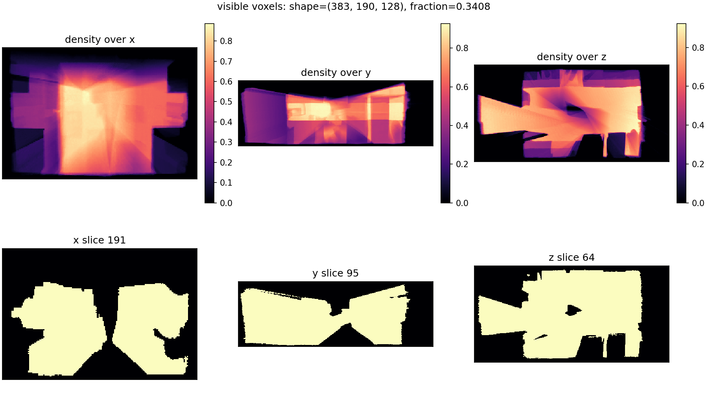

# Occlusion Masks

This page describes how to generate occlusion masks, the mask artifact format,
the transform convention, and how masks are applied during evaluation.

## Generating masks

When computing metrics, if a predicted point is in a region that is not observed in the ground-truth data, it may be unfair to count it as an error. To address this, we can use occlusion masks to identify which regions of the scene are visible (i.e., observed) and which are occluded (i.e., unobserved). During evaluation, we can then ignore predicted points that fall into occluded regions.

`e3r mask gen` builds a volumetric occlusion mask from selected views. It
supports three input modes:



- `--preset NAME --root PATH --scene ID`: use a registered dataset adapter.
- `--depth-path DIR --poses-path PATH --intrinsics-path K.txt`: use sensor
  depth maps.
- `--mesh-path mesh.ply --poses-path PATH --intrinsics-path K.txt`: render
  depth from a mesh, then generate the mask from the rendered depth.

Example using depth images:

```bash
e3r mask gen \
  --depth-path /data/scene/depth \
  --depth-pattern "{frame:06d}.png" \
  --poses-path /data/scene/poses \
  --poses-pattern "{frame:06d}.txt" \
  --intrinsics-path /data/scene/intrinsic_depth.txt \
  --depth-scale 1000 \
  --pose-convention T_cw \
  --camera-frame opencv \
  --max-depth 3.5 \
  --voxel-size 0.02 \
  --out-dir /data/masks/scene0001_00
```

The command writes:

- `occlusion_mask.npy`
- `T_mask_scene.txt`

### Generation behavior

Mask generation has two stages:

1. **BBox construction**: selected valid depth pixels are back-projected into
   scene/world coordinates. Their bounds, plus `--margin`, define the mask
   volume. Pixels that are non-finite, non-positive, or farther than
   `--max-depth` are ignored.
2. **Voxel carving**: voxel centers are projected into each selected camera.
   A voxel is marked visible if it lands inside the camera frustum and its
   camera-frame depth is no farther than `depth_at_pixel + truncation`.

Because the bbox is depth-derived, the generated volume is tight around
observed geometry. Empty space between the camera and the observed surface may
fall outside the mask volume unless it is within the padded depth-sample bounds.
During evaluation, out-of-bounds points are treated as occluded.

If no selected depth pixels survive filtering, generation fails with a
`depth-derived bbox` error. Increase `--max-depth`, check `--depth-scale`, or
select frames with valid depth.

Useful generation options:

| Flag | Purpose |
| ---- | ------- |
| `--max-depth` | Discard farther depth pixels and bound carving/projection. |
| `--voxel-size` | Output grid resolution in metres. Smaller is tighter but larger. |
| `--margin` | Padding added around the depth-derived bbox. |
| `--truncation` | Visible band behind surfaces. Defaults to `4 * voxel_size`. |
| `--frame-stride` | Process every Nth frame. |
| `--frames` / `--frames-file` | Explicitly select frames. |
| `--dilation` | Dilate visible voxels after carving. |

Inspect a generated mask with:

```bash
e3r mask inspect \
  --mask /data/masks/scene0001_00/occlusion_mask.npy \
  --t-mask-scene /data/masks/scene0001_00/T_mask_scene.txt
```

## Mask artifact format

For each scene, provide a directory with:

- `occlusion_mask.npy`: a 3D array `(D_x, D_y, D_z)` where
  - `0` means **visible**
  - `1` means **occluded**
- `T_mask_scene.txt`: a whitespace-delimited `4x4` matrix.

### Transform convention

`T_mask_scene` maps homogeneous **scene/world** coordinates to continuous mask voxel coordinates:

- input: `[x, y, z, 1]^T`
- output: `[i, j, k, 1]^T`

So:

```text
[i, j, k, 1]^T = T_mask_scene @ [x, y, z, 1]^T
```

`[i, j, k]` are continuous voxel coordinates used with trilinear interpolation.
Integer values index voxel centers.

## Sampling and visibility rule

During filtering:

1. Points are transformed to voxel space with `T_mask_scene`.
2. Mask values are sampled trilinearly from `occlusion_mask.npy`.
3. Out-of-bounds samples are treated as occluded (`1.0`).
4. A point is kept iff sampled mask value `< 0.5`.

If all points are marked occluded, eval3r raises an error. This usually means
the mask transform, coordinate frame, or unit scale does not match the evaluated
geometry.

## Applying masks

### Metric CLI

Use explicit per-scene mask paths with:

- `--mask`
- `--t-mask-scene`
- `--mask-mode` in `{pred, gt, both}` (default: `pred`)

Example:

```bash
e3r metric all outputs/scannet/scene0001_00 \
  --gt /data/scannet/scene0001_00/gt_mesh.ply \
  --mask /data/scannet_masks/scene0001_00/occlusion_mask.npy \
  --t-mask-scene /data/scannet_masks/scene0001_00/T_mask_scene.txt \
  --mask-mode both
```

### Benchmark CLI

Use a mask root plus path patterns relative to that root:

- `--mask-dir`
- `--mask-pattern` (default: `{scene_id}/occlusion_mask.npy`)
- `--t-mask-scene-pattern` (default: `{scene_id}/T_mask_scene.txt`)

Benchmark masks are always applied to predicted points only.

```bash
e3r benchmark outputs/scannet \
  --dataset scannet \
  --root /data/scannet \
  --mask-dir /data/scannet_masks
```

Flat layouts are supported by including `{scene_id}` in the filename:

```bash
e3r benchmark outputs/scannet \
  --dataset scannet \
  --root /data/scannet \
  --mask-dir /data/scannet_masks \
  --mask-pattern "{scene_id}_mask.npy" \
  --t-mask-scene-pattern "{scene_id}_T_mask_scene.txt"
```

## Mask mode semantics

The metric CLI supports explicit mask modes:

- `pred`: apply mask only to predicted points.
- `gt`: apply mask only to ground-truth points.
- `both`: apply mask to both predicted and ground-truth points.

The benchmark CLI does not expose mask modes; it always uses `pred`.
