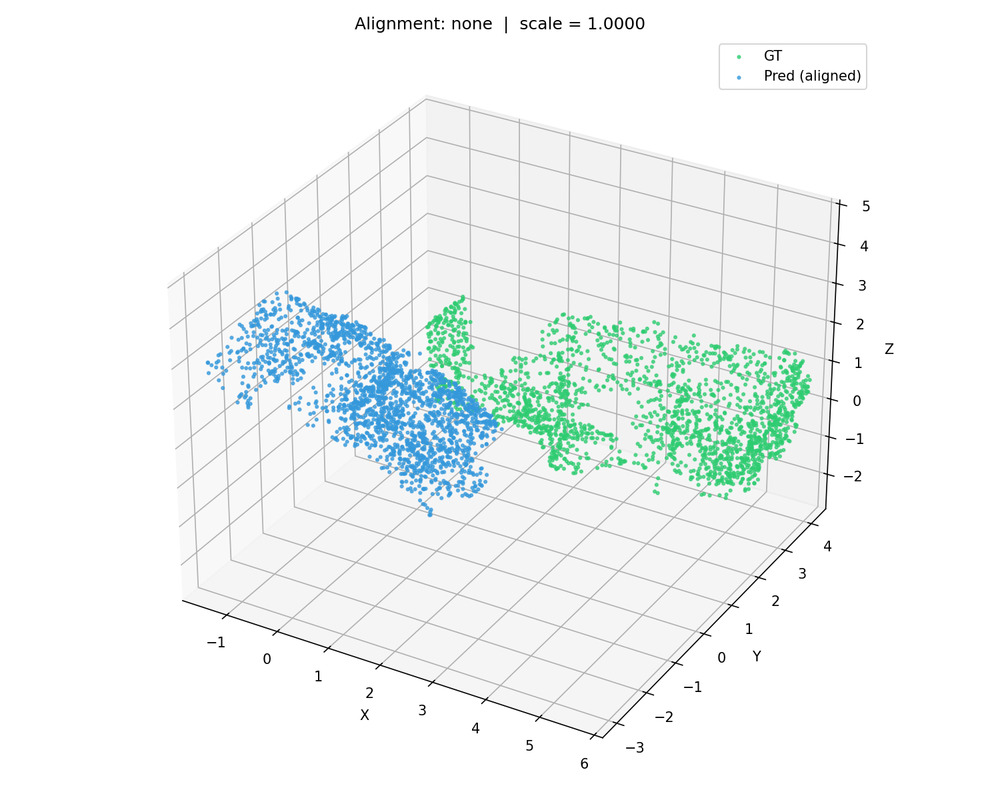
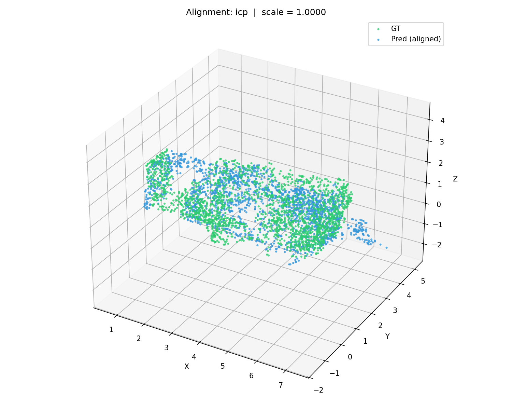
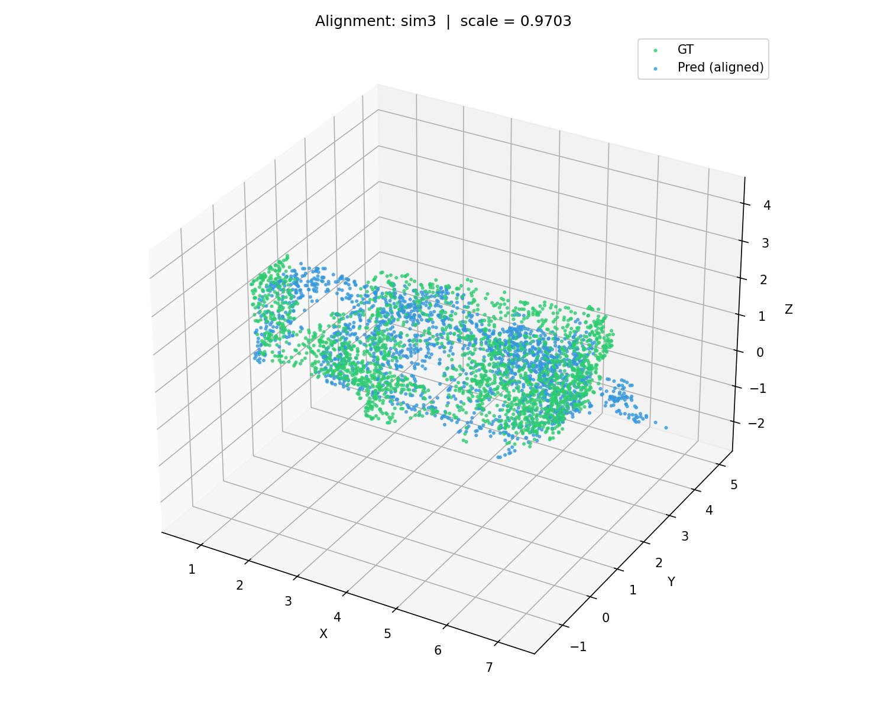
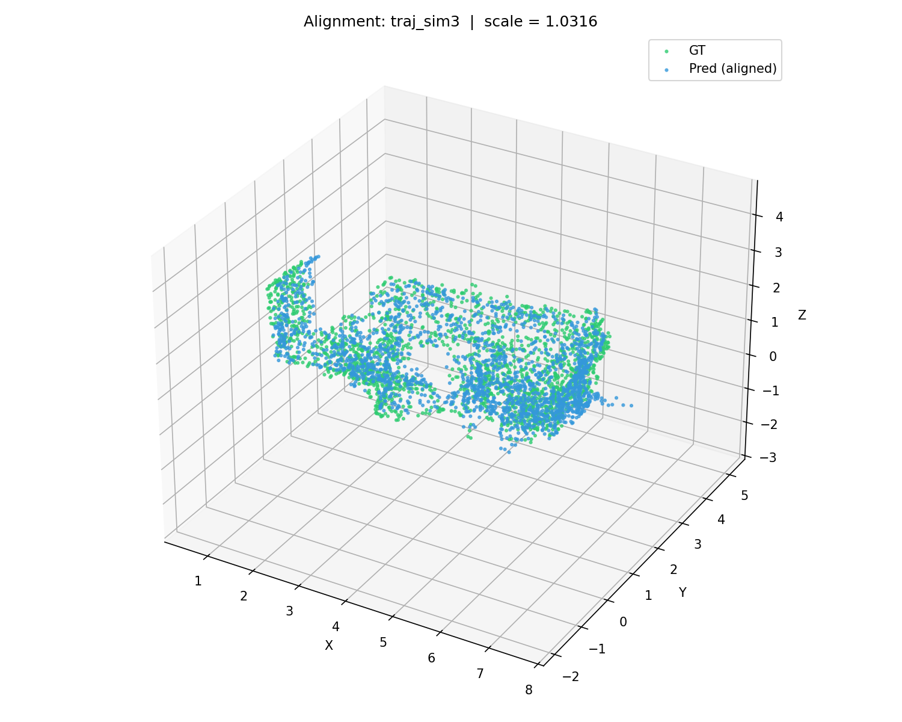

# Metric Computation

`eval3r` computes 3D reconstruction metrics through the `e3r metric` command. The predicted geometry is compared against ground-truth geometry using nearest-neighbor distance queries. These distances are then used to derive metrics such as Chamfer distance, accuracy, completeness, precision, recall, and F-score.

A typical command looks like this:

```bash
e3r metric all pred.ply --gt gt.ply
```

The input geometry can be either a mesh or a point cloud. When a mesh is provided, `eval3r` first samples points from the mesh surface before computing point-based metrics.

## Align-then-evaluate Paradigm

Modern 3D reconstruction networks often predict geometry and camera trajectories only **up to an unknown scale**. Even methods designed to predict metric-scale geometry may still have small scale, rotation, or translation errors. Because of this, directly comparing a predicted mesh or point cloud against the ground truth can produce misleadingly poor metrics.

`eval3r` therefore provides explicit alignment modes before metric computation. The alignment step transforms the predicted geometry into the ground-truth coordinate system. Metrics are then computed after alignment.

The general evaluation pipeline is:

```text
prediction geometry
        ↓
sample points
        ↓
optional alignment to ground truth
        ↓
nearest-neighbor distance computation
        ↓
Chamfer / accuracy / completeness / precision / recall / F-score
```

Suppose we have two meshes or point clouds:

```text
pred.ply
gt.ply
```

A direct evaluation without alignment can be run with:

```bash
e3r metric all pred.ply --gt gt.ply
```

Example output:

```text
            eval3r — geometry metrics            
┏━━━━━━━━━━━━━━━━━┳━━━━━━━━━━━━━━━━━━━━━━━━━━━━━┓
┃ metric          ┃ value                       ┃
┡━━━━━━━━━━━━━━━━━╇━━━━━━━━━━━━━━━━━━━━━━━━━━━━━┩
│ chamfer         │ 2.237587                    │
│ chamfer_variant │ l1_mean_bidirectional       │
│ accuracy        │ 1.767983                    │
│ completeness    │ 2.707190                    │
│ f-score @ 0.05  │ 0.0136  (P=0.0137 R=0.0134) │
│ samples         │ 200000                      │
│ seed            │ 42                          │
│ sample_method   │ area                        │
│ align_mode      │ none                        │
└─────────────────┴─────────────────────────────┘
```

In this case, `align_mode` is `none`, so the prediction and ground truth are compared in their original coordinate systems. If the prediction is shifted, rotated, or scaled relative to the ground truth, the metrics will be dominated by global coordinate mismatch rather than local reconstruction quality.

The two geometries can be visualized in the same coordinate system using the `--debug-plot` option:

```bash
e3r metric all pred.ply --gt gt.ply --debug-plot
```



Without alignment, the predicted and ground-truth shapes may appear far apart, differently oriented, or differently scaled. This is no way to evaluate predictions unless the method is expected to recover the exact global coordinate frame.

## Geometry Alignment

### ICP Alignment

A common way to evaluate geometric quality is to align the predicted geometry to the ground truth using **Iterative Closest Point**, or ICP.

ICP estimates a rigid transformation between the predicted and ground-truth point clouds. This transformation includes rotation and translation, but keeps scale fixed. It is useful when the prediction is expected to have the correct metric scale but may not be perfectly registered to the ground-truth coordinate system.

Run ICP-aligned evaluation with:

```bash
e3r metric all pred.ply --gt gt.ply --align icp
```

Example output:

```text
            eval3r — geometry metrics            
┏━━━━━━━━━━━━━━━━━┳━━━━━━━━━━━━━━━━━━━━━━━━━━━━━┓
┃ metric          ┃ value                       ┃
┡━━━━━━━━━━━━━━━━━╇━━━━━━━━━━━━━━━━━━━━━━━━━━━━━┩
│ chamfer         │ 0.256818                    │
│ chamfer_variant │ l1_mean_bidirectional       │
│ accuracy        │ 0.266786                    │
│ completeness    │ 0.246850                    │
│ f-score @ 0.05  │ 0.1197  (P=0.1152 R=0.1245) │
│ samples         │ 200000                      │
│ seed            │ 42                          │
│ sample_method   │ area                        │
│ align_mode      │ icp                         │
│ align_scale     │ 1.000000                    │
└─────────────────┴─────────────────────────────┘
```

The lower Chamfer distance after ICP alignment indicates that a large part of the original error came from global misalignment rather than local reconstruction quality.



ICP alignment is suitable when:

* the predicted geometry is already roughly at the correct scale;
* the predicted and ground-truth geometries have enough overlap;
* the initial pose is reasonably close;
* the prediction does not contain too many severe outliers.

However, ICP is not guaranteed to find the correct alignment. It is a local optimization method and can fail when the initial geometry is too far from the ground truth, when the scene has repeated structures, or when the two point clouds have insufficient overlap.

### Sim(3) Alignment

For many feedforward 3D reconstruction models, the predicted geometry may be correct only up to a **similarity transformation**. A Sim(3) transformation includes:

```text
scale
rotation
translation
```

Even models that predict metric scale may produce slightly inaccurate scale estimates. In that case, rigid ICP alignment can still leave residual scale error. `eval3r` therefore also supports Sim(3) alignment.

Run Sim(3)-aligned evaluation with:

```bash
e3r metric all pred.ply --gt gt.ply --align sim3
```

Example output:

```text
            eval3r — geometry metrics            
┏━━━━━━━━━━━━━━━━━┳━━━━━━━━━━━━━━━━━━━━━━━━━━━━━┓
┃ metric          ┃ value                       ┃
┡━━━━━━━━━━━━━━━━━╇━━━━━━━━━━━━━━━━━━━━━━━━━━━━━┩
│ chamfer         │ 0.263353                    │
│ chamfer_variant │ l1_mean_bidirectional       │
│ accuracy        │ 0.267911                    │
│ completeness    │ 0.258795                    │
│ f-score @ 0.05  │ 0.1171  (P=0.1122 R=0.1224) │
│ samples         │ 200000                      │
│ seed            │ 42                          │
│ sample_method   │ area                        │
│ align_mode      │ sim3                        │
│ align_scale     │ 0.970263                    │
└─────────────────┴─────────────────────────────┘
```

Here, `align_scale` is `0.970263`, meaning the predicted geometry was rescaled during alignment before metric computation.



Sim(3) alignment is useful when:

* the method predicts geometry up to scale;
* the method is monocular or feedforward;
* the global metric scale is unreliable;
* the goal is to evaluate shape quality rather than absolute scale recovery.

However, Sim(3) alignment should be interpreted carefully. In the example above, the aligned mesh is may appear correctly registered, but upon careful examination you may find it is acutally flipped upside down. This can happen when the geometry is too symmetric, the initial pose is poor, or the prediction contains many outliers. Since `eval3r` uses ICP together with Sim(3) refinement to improve alignment, a failed ICP initialization will also lead to a failed Sim(3) alignment.

For this reason, Sim(3)-aligned results should not be trusted blindly. Always inspect the debug visualization when using alignment-based metrics.

## Trajectory-based Alignment

### Trajectory SE(3) and Sim(3) Alignment

If a method predicts both geometry and camera trajectory, `eval3r` can align the reconstruction using the predicted and ground-truth trajectories. This is often preferable to pure geometry alignment because the camera trajectory provides a stronger global alignment signal than two unordered point clouds.

`eval3r` supports trajectory-based alignment modes such as:

```text
traj_se3
traj_sim3
```

These modes first align the predicted camera trajectory to the ground-truth camera trajectory. The resulting transformation is then applied to the predicted geometry before geometry metrics are computed.

This is useful for methods that jointly estimate geometry and camera poses, such as:

* SLAM systems;
* NeRF-style reconstruction methods;
* RGB-D reconstruction systems;
* online mapping methods;
* feedforward models that output both geometry and camera poses.

An example trajectory-aligned result:

```text
            eval3r — geometry metrics            
┏━━━━━━━━━━━━━━━━━┳━━━━━━━━━━━━━━━━━━━━━━━━━━━━━┓
┃ metric          ┃ value                       ┃
┡━━━━━━━━━━━━━━━━━╇━━━━━━━━━━━━━━━━━━━━━━━━━━━━━┩
│ chamfer         │ 0.077078                    │
│ chamfer_variant │ l1_mean_bidirectional       │
│ accuracy        │ 0.094889                    │
│ completeness    │ 0.059268                    │
│ f-score @ 0.05  │ 0.4653  (P=0.4434 R=0.4895) │
│ samples         │ 200000                      │
│ seed            │ 42                          │
│ sample_method   │ area                        │
│ align_mode      │ traj_sim3                   │
│ align_scale     │ 1.031622                    │
└─────────────────┴─────────────────────────────┘
```

In this example, the Chamfer distance is lower than with geometry-only ICP or Sim(3) alignment, indicating that the trajectory provides a better estimate of the global transformation.



After trajectory-based alignment, the predicted geometry is much better registered to the ground truth. This alignment mode is recommended when the method is intended to predict a camera trajectory and the trajectory is part of the reconstruction output.

### When to Use `traj_se3`

Use `traj_se3` when the predicted trajectory is expected to be in the correct metric scale, but may differ from the ground truth by a rigid transformation.

This mode estimates:

```text
rotation
translation
```

but keeps scale fixed.

This is appropriate for:

* RGB-D SLAM systems;
* stereo SLAM systems;
* metric-scale reconstruction pipelines;
* methods that use known depth or stereo baseline;
* systems where scale error should be penalized.

### When to Use `traj_sim3`

Use `traj_sim3` when the predicted trajectory may be correct only up to a similarity transformation.

This mode estimates:

```text
scale
rotation
translation
```

This is appropriate for:

* monocular SLAM systems;
* monocular NeRF or Gaussian reconstruction systems;
* feedforward monocular reconstruction methods;
* methods where global scale is not directly observable;
* evaluations focused on shape quality rather than metric-scale accuracy.

### Pose Convention

Trajectory alignment requires consistent pose conventions. In `eval3r`, pose files should clearly specify whether poses are stored as `T_wc` or `T_cw`.

The convention is:

```text
T_ab = transform from frame b to frame a
```

Therefore:

```text
T_wc = camera-to-world transform
T_cw = world-to-camera transform
```

For `T_wc`:

```text
p_w = T_wc @ p_c
```

For `T_cw`:

```text
p_c = T_cw @ p_w
```

They are inverses:

```text
T_cw = inverse(T_wc)
T_wc = inverse(T_cw)
```

This distinction is important because camera trajectories are usually saved as camera-to-world poses, while rendering and projection code often expects world-to-camera extrinsics. Passing `T_wc` where `T_cw` is expected can lead to completely incorrect alignment or rendering.

For prediction export, specify the pose convention explicitly:

```python
writer.save_poses(poses, timestamps=timestamps, convention="T_wc")
```

or:

```python
writer.save_poses(poses, timestamps=timestamps, convention="T_cw")
```

## Choosing an Alignment Mode

`eval3r` supports several alignment modes:

```text
none
  No alignment. The prediction and ground truth are compared directly.

icp
  Rigid ICP alignment based on geometry.
  Estimates rotation and translation, but keeps scale fixed.

sim3
  Similarity alignment based on geometry.
  Estimates scale, rotation, and translation.

traj_se3
  Rigid alignment based on camera trajectory.
  Estimates rotation and translation, but keeps scale fixed.

traj_sim3
  Similarity alignment based on camera trajectory.
  Estimates scale, rotation, and translation.
```

A practical recommendation:

| Alignment mode | Use when                                                                  | What it evaluates                                                |
| -------------- | ------------------------------------------------------------------------- | ---------------------------------------------------------------- |
| `none`         | The method should recover the exact metric-scale global coordinate frame. | Geometry quality plus global-frame correctness.                  |
| `icp`          | The method should recover scale but may have rigid registration error.    | Geometry quality after rigid geometry registration.              |
| `sim3`         | The method predicts geometry up to scale.                                 | Shape quality after scale, rotation, and translation correction. |
| `traj_se3`     | The method predicts a metric-scale trajectory.                            | Geometry quality after rigid trajectory alignment.               |
| `traj_sim3`    | The method predicts a trajectory up to scale.                             | Geometry quality after similarity trajectory alignment.          |

For papers, always report the alignment protocol explicitly. For example:

```text
We report Chamfer distance and F-score after Sim(3) alignment between the predicted and ground-truth point clouds.
```

or:

```text
We report geometry metrics after trajectory-based Sim(3) alignment using the predicted and ground-truth camera poses.
```

or:

```text
We report metrics without alignment to evaluate metric-scale reconstruction accuracy.
```

Avoid reporting aligned metrics without specifying which alignment was used.

## Debugging Alignment

Alignment can be time-consuming, especially for large meshes or dense point clouds. It is also error-prone: precise alignment of two noisy, incomplete point clouds remains difficult in practice.

Alignment methods require a reasonably good reconstruction or trajectory estimate to start with. They may fail when:

* the prediction has too many outliers;
* the prediction and ground truth have little overlap;
* the initial pose is very poor;
* the scene has repeated or symmetric structures;
* the sampled points are too sparse;
* the geometry is incomplete;
* the predicted trajectory uses the wrong pose convention;
* the predicted and ground-truth trajectories have mismatched timestamps or frame ordering.

To inspect the alignment quality, use the debug visualization option:

```bash
e3r metric all pred.ply --gt gt.ply --align icp --debug-plot
```

or:

```bash
e3r metric all pred.ply --gt gt.ply --align sim3 --debug-plot
```

For trajectory-based alignment:

```bash
e3r metric all pred.ply --gt gt.ply \
  --align traj_sim3 \
  --pred-traj pred_trajectory.txt \
  --gt-traj gt_trajectory.txt \
  --debug-plot
```

The debug plot should be checked before trusting the numbers. Good metrics after a failed alignment are not meaningful.

A recommended workflow is:

```bash
# 1. Direct comparison
e3r metric all pred.ply --gt gt.ply --debug-plot

# 2. Geometry-based rigid alignment
e3r metric all pred.ply --gt gt.ply --align icp --debug-plot

# 3. Geometry-based similarity alignment
e3r metric all pred.ply --gt gt.ply --align sim3 --debug-plot

# 4. Trajectory-based similarity alignment, if trajectories are available
e3r metric all pred.ply --gt gt.ply \
  --align traj_sim3 \
  --pred-traj pred_trajectory.txt \
  --gt-traj gt_trajectory.txt \
  --debug-plot
```

Then compare the results. If `none`, `icp`, and `sim3` give very different numbers, the reconstruction likely has a global-frame or scale issue. If `icp` and `sim3` are similar, the prediction is probably close to the correct scale. If `traj_sim3` is much better than geometry-based alignment, the trajectory may provide a more reliable global alignment signal than unordered point-cloud registration.

## Important Notes

Alignment changes the interpretation of the metrics.

```text
No alignment:
  Measures reconstruction quality plus global coordinate accuracy.

ICP alignment:
  Measures reconstruction quality after rigid geometry registration.

Sim(3) alignment:
  Measures reconstruction quality after geometry-based scale, rotation, and translation correction.

Trajectory SE(3) alignment:
  Measures reconstruction quality after rigid trajectory alignment.

Trajectory Sim(3) alignment:
  Measures reconstruction quality after trajectory-based scale, rotation, and translation correction.
```

Therefore, `eval3r` records the alignment protocol in the metric output:

```text
align_mode
align_scale
```

When applicable, it should also record trajectory-related alignment metadata, such as:

```text
pred_traj
gt_traj
pose_convention
num_matched_poses
trajectory_alignment_error
```

This makes results easier to reproduce and helps avoid mixing incompatible evaluation protocols.

In general, report both the metric values and the alignment settings. A result such as:

```text
Chamfer = 0.077 after traj_sim3 alignment
```

does not mean the same thing as:

```text
Chamfer = 0.077 without alignment
```

The alignment mode is part of the evaluation protocol and should be treated as part of the reported result.
