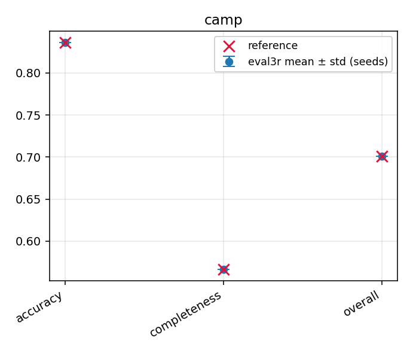
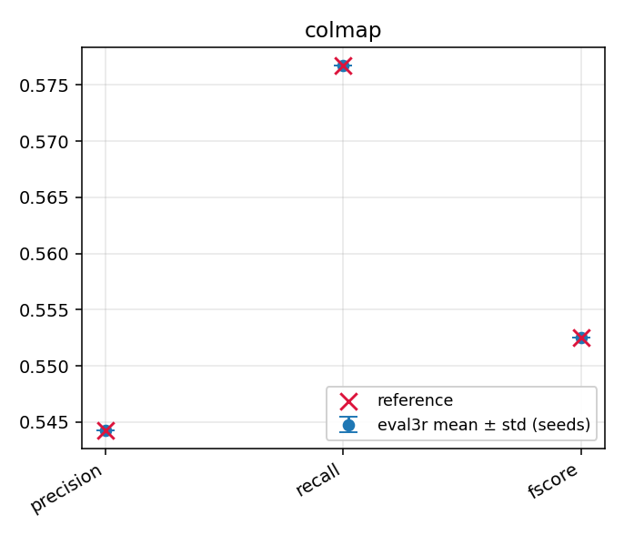
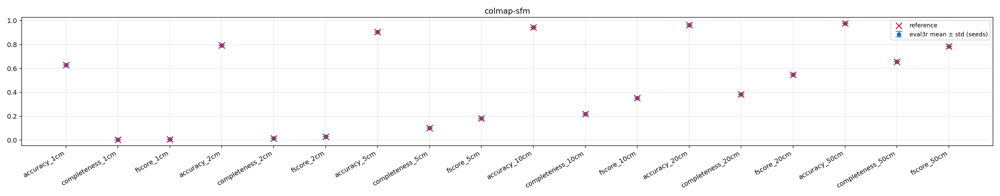
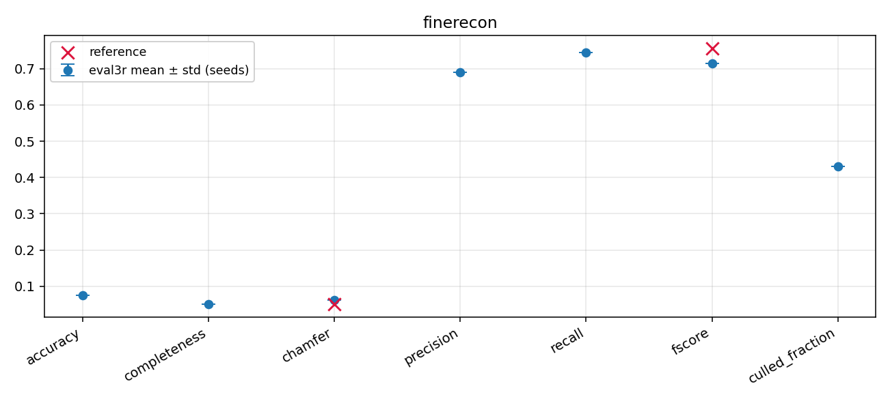
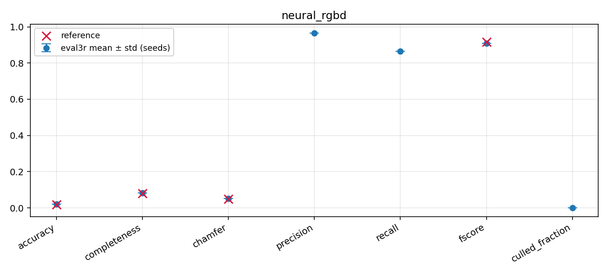

# Reproducibility

A result is useful only when it can be understood, audited, and rerun. eval3r records the
protocol, dataset variant, ground-truth meaning, backend choices, failures, and
environment for every run. No number is reported without enough metadata to know what it
means.

Principles:

```text
A metric number is inseparable from its protocol (and its hash).
A dataset name is not enough; variant and GT provenance are recorded.
Partial scene coverage is always visible.
Backend choices and versions are always recorded.
Official-like claims require regression tests or wrapped official behavior.
Server-only splits never produce local official-looking numbers.
```

## What every run records

See [Result schema](schema.md) for the run directory and `results.json` contents. Beyond
metrics: the protocol name/version/**hash**, fidelity, dataset variant, GT
provenance/independence/density and **fingerprint**, local-evaluation status, the
alignment/masking/sampling/confidence/failure policies in effect, recorded overrides,
prediction adaptation metadata, scene coverage and structured failures, backend names
and versions (including official tool commits and any compatibility patch applied to make
an official tool run), the resolved command, and platform/Python facts.

## Ground-truth fingerprinting

Fingerprints identify the reference actually used, not just its dataset name: DTU hashes
the GT point cloud (ObsMask/Plane availability is recorded per scene); Tanks and Temples
jointly hashes GT point cloud + crop volume + alignment transform; ETH3D jointly hashes
`scan_alignment.mlp` + every referenced scan PLY; ScanNet hashes the GT mesh variant the
protocol selected.

## Environment metadata privacy

`environment.json` deliberately contains only minimal, non-identifying facts: eval3r
version, Python version/implementation, platform/OS/CPU architecture, and the resolved
command. It never contains secrets, environment variables, working directories or other
absolute local paths, hostnames, usernames, git state, or timestamps. (A single ordering
`timestamp` lives on the RunResult itself, and `git_commit` is an optional field you can
set explicitly.)

## Report comparability

Reports and `e3r diff` make incomparability visible. A warning fires when any of these
differ between two runs:

```text
protocol hash          (loose mode only — strict mode refuses outright)
GT provenance / independence
local evaluation status
scene coverage
failure policy
alignment mode
confidence policy
sampling counts
backend officialness   (fidelity and the official_eval backend used)
```

`e3r diff` refuses strict comparisons when protocol hashes differ; `--loose` allows the
comparison but labels every output NON-STRICT. Prediction adaptation records are kept for
reproducibility and auditability; they are not comparability warnings.

## Determinism

Sampling seeds are protocol-pinned (derived per scene from the protocol base seed and
scene ID), so repeated runs under the same protocol hash reproduce the same numbers.
Overrides are recorded and change the hash, so a tweaked run can never masquerade as the
canonical protocol.

## Data and credentials

Run directories and committed fixtures never contain API keys, tokens, cookies,
benchmark-server credentials, licensed datasets, or large raw data. CI uses tiny
synthetic fixtures; instructions for acquiring full datasets live in the docs, not the
repository.

## Reproducibility report

Every implemented dataset and protocol path is checked against the **real** official
evaluator — or a named community reference — on byte-identical inputs. No number below
comes from a fake, stubbed, or vendored stand-in evaluator; the official-code rule in
`CLAUDE.md` forbids it, and this section records what the real tools produced.

The work and its evidence live in task 028
(`.agent/tasks/028-known-good-benchmarks.md`) and in an external, append-only
reproducibility corpus (`inventory.yaml` is its source of truth). Datasets, predictions,
reference logs, and run directories are kept outside the repository; nothing large or
licensed is committed here.

### How each number was produced

```text
Repetition        2 same-seed reps (determinism, must be bit-identical)
                  + 5 seed-varied reps (mean ± std over 6 distinct seeds).
References        the real official toolbox / binary / named community driver,
                  run on identical inputs, >=3x where invocable to measure spread.
Tolerance         each metric's pass band is written down before the comparison.
Done criterion    a path is done only when it clears its band, or is recorded
                  blocked with the exact missing asset.
```

eval3r's sampling base seed is [run configuration](#determinism): the seed-varied reps
pass explicit `--seed N` overrides (recorded in `config.yaml` and `results.json`
`metadata.base_seed`), while same-seed reps must reproduce bit-identical aggregates. Every
same-seed pair compared equal — no drift was observed on any path.

### Summary

Six paths validated (two to bit-exact parity), three recorded as blocked. All 41 run
directories pass the metadata checklist (`scripts/check_run_metadata.py`, 0 problems); the
repository test suite is 543 passed / 6 skipped (the 6 are the ETH3D and Tanks-and-Temples
real-tool env-var guards, both exercised for real with the tools configured); `ruff` clean.

| Dataset / protocol | Method | Headline (eval3r) | Reference | Verdict |
|---|---|---|---|---|
| `dtu_native_pointcloud` | camp | overall **0.701238 ± 6.8e-6** mm (22 scans, 6 seeds) | 0.701236 (DTUeval-python, identical files) | **PASS** |
| `tanks_temples_training_official` | colmap (shipped) | mean F **0.552529** (bit-identical reps) | 0.552529 (official toolbox ×3) | **PASS · exact** |
| `eth3d_training_official` | colmap-sfm points | F1@2cm **0.0293307** | 0.0293307 (official binary ×3) | **PASS · exact** |
| `scannet_test_single_layer_geometry_5cm` | FineRecon 4 cm | F **0.714470 ± 7.3e-5** (100 scenes, 6 seeds) | 0.756 (paper, indicative) | **PASS · caveat** |
| `neural_rgbd_geometry_culled` | neural_rgbd (shipped) | F **0.907639 ± 1.6e-4** (9 scenes, 6 seeds) | 0.915800 (GO-Surf driver ×3) | **PASS** |
| `neural_rgbd_geometry_source` | neural_rgbd | F **0.488380 ± 2.3e-4** | none (uncropped-GT variant) | recorded |

Analysis artifacts for each campaign (`aggregate.md`/`.csv`, `errorbars.png`,
`determinism.md`) live next to the reps under
`runs/<eval3r_commit>/<dataset>/<protocol>/<method>/analysis/` in the corpus.

### DTU — native point cloud

Reference: the real `jzhangbs/DTUeval-python` checkout (`@45b4fec`, `eval.py --mode pcd`)
run on the **same prediction files**. MATLAB is absent on this machine and that is recorded
explicitly. Over 22 scans × 3 metrics the worst single-scene disagreement is **9.6e-5 mm**
(scan13 accuracy) — the same order as the reference tool's own run-to-run spread
(≤7.5e-5 mm across 3 repeats).

| metric (mm) | mean | std | reference | Δ | tol | verdict |
|---|---|---|---|---|---|---|
| accuracy | 0.836108 | 1.0e-5 | 0.836102 | +6.2e-6 | 0.001 | PASS |
| completeness | 0.566368 | 4.0e-6 | 0.566369 | −6.2e-7 | 0.001 | PASS |
| overall | 0.701238 | 6.8e-6 | 0.701236 | +2.3e-6 | 0.001 | PASS |



*eval3r mean ± std over 6 seeds (bars) vs DTUeval-python (line); the same-seed pair is bit-identical.*

Cross-checking furu and tola against published R-MVSNet means: accuracy matches ≤1e-3 for
all three methods; completeness sits +0.008–0.015 higher, the known MATLAB↔python-port
difference — not an eval3r artifact, since the exact-file reference agrees to 1e-4.

### Tanks and Temples — official toolbox

eval3r **wraps** the real isl-org toolbox, so the bar is exact agreement, not tolerance.
The toolbox (`@2a0d1b25`, `open3d==0.9` in a dedicated Python 3.7 conda env) was run
directly ×3 per scene — deterministic, bit-identical — and eval3r reproduces its
precision / recall / F-score on **all 7 training scenes to Δ 0.0000**. Per-scene
`distance_tau` is read from the official output (0.003–0.025, not a global constant).

| scene | τ | eval3r F | toolbox F | Δ |
|---|---|---|---|---|
| Barn | 0.010 | 0.5003 | 0.5003 | 0.0000 |
| Caterpillar | 0.005 | 0.5570 | 0.5570 | 0.0000 |
| Church | 0.025 | 0.5310 | 0.5310 | 0.0000 |
| Courthouse | 0.025 | 0.4563 | 0.4563 | 0.0000 |
| Ignatius | 0.003 | 0.8055 | 0.8055 | 0.0000 |
| Meetingroom | 0.010 | 0.3431 | 0.3431 | 0.0000 |
| Truck | 0.005 | 0.6745 | 0.6745 | 0.0000 |
| **mean** | — | **0.5525** | **0.5525** | **0.0000** |



*Mean precision / recall / F-score; eval3r reps are bit-identical and overlay the direct-toolbox reference exactly.*

The known method is the benchmark's own dataset-shipped `<Scene>_COLMAP.ply`; the paper
table is intentionally not asserted, because the same-invocation toolbox output is the
recorded source of truth.

### ETH3D — official binary

Reference: the real `ETH3DMultiViewEvaluation` binary (`@0daa4f4d`), run directly ×3
(bit-identical — deterministic). eval3r reproduces **all 18 values** — accuracy /
completeness / F1 at 1, 2, 5, 10, 20, 50 cm — to bit equality.

| tolerance | accuracy | completeness | F1 | Δ vs binary |
|---|---|---|---|---|
| 1 cm | 0.627778 | 0.002439 | 0.004860 | 0 |
| 2 cm | 0.793235 | 0.014942 | 0.029331 | 0 |
| 5 cm | 0.904290 | 0.101366 | 0.182298 | 0 |
| 10 cm | 0.944797 | 0.217351 | 0.353401 | 0 |
| 20 cm | 0.963929 | 0.382831 | 0.548015 | 0 |
| 50 cm | 0.978308 | 0.655893 | 0.785295 | 0 |



*Accuracy / completeness / F1 across six tolerances; eval3r equals the official binary at every point.*

The known method is ETH3D's own shipped COLMAP SfM sparse points. The misconfigured-tool
path was also verified: without `EVAL3R_ETH3D_TOOL` the run fails with an explicit
remediation message — no silent fallback.

### ScanNet — test single-layer geometry

Native community numbers (there is no official ScanNet local tool). The reference is the
FineRecon paper (Stier et al., ICCV 2023) Table 3 "Ours / 4 cm" row, flagged
**indicative-only**: the paper trims predictions with TransformerFusion occlusion masks,
while this protocol does its own render+TSDF visibility culling.

| metric | mean | std | paper | Δ | tol | verdict |
|---|---|---|---|---|---|---|
| f-score | 0.714470 | 7.3e-5 | 0.756 | −0.0415 | 0.05 | PASS |
| chamfer (m) | 0.062588 | 6.2e-5 | 0.0515 | +0.0111 | 0.01 | outside |
| accuracy (m) | 0.074556 | 1.2e-4 | ~0.0525 | +0.022 | — | — |
| completeness (m) | 0.050620 | 2.3e-5 | ~0.0511 | −0.0005 | — | — |



*eval3r mean ± std over 6 seeds; 7 × 100 scenes, 0 failures.*

Completeness (GT→pred) matches the paper to **0.5 mm**; the entire chamfer gap lives in
accuracy (pred→GT). That is the expected signature of mask-*trimming* (which deletes
prediction surface in unobserved regions) versus render+TSDF *culling*. The protocol was
**not** tweaked to chase the table; an exact-comparability mask-trim variant is possible
future work, not part of task 028 (no new protocols). Campaign: 7 × 100 scenes, 0 failures,
`culled_fraction` 0.4308 (seed-independent).

### Neural-RGBD — culled mesh geometry

Reference: the real GO-Surf community driver (`@71bb125`,
`mesh_metrics.compute_metrics`) run ×3 on the same meshes.

| metric | mean | std | GO-Surf | Δ | tol | verdict |
|---|---|---|---|---|---|---|
| accuracy | 0.020880 | 1.6e-5 | 0.016989 | +0.0039 | 0.005 | PASS |
| completeness | 0.082224 | 4.9e-4 | 0.079580 | +0.0026 | 0.005 | PASS |
| chamfer | 0.051552 | 2.5e-4 | 0.048284 | +0.0033 | 0.005 | PASS |
| f-score | 0.907639 | 1.6e-4 | 0.915800 | −0.0082 | 0.02 | PASS |



*eval3r mean ± std over 6 seeds vs the GO-Surf reference; the same-seed pair is bit-identical.*

A matched-sampling diagnostic — re-running GO-Surf's own distance functions at eval3r's
pinned 200k samples/side — **proves** the residual is sampling density, not formula: the
two agree to ~1e-5. The `source` (uncropped-GT) protocol was also run (F 0.488380 ± 2.3e-4)
but is recorded as internal statistics only, since no external reference exists for that
variant and completeness/recall are not comparable across the culled/source split.

### Blocked paths — recorded, not skipped

```text
ScanNet val         single-/double-layer protocols have no val-split predictions from a
                    known published method (needs a supplied val-split reconstruction).
ETH3D leaderboard   ETH3D does not distribute submitted reconstructions, so a published-
                    method cross-check is impossible; the remaining 12 scenes' dense-
                    calibration archives can be appended the same way later.
DTU MATLAB          the official MATLAB script has no MATLAB on this machine; the validated
                    DTUeval-python port is the exact-file reference instead.
```

ScanNet and Neural-RGBD are validated as **native community comparisons**, not official
benchmark results. Server-only splits never produce local official-looking numbers.
